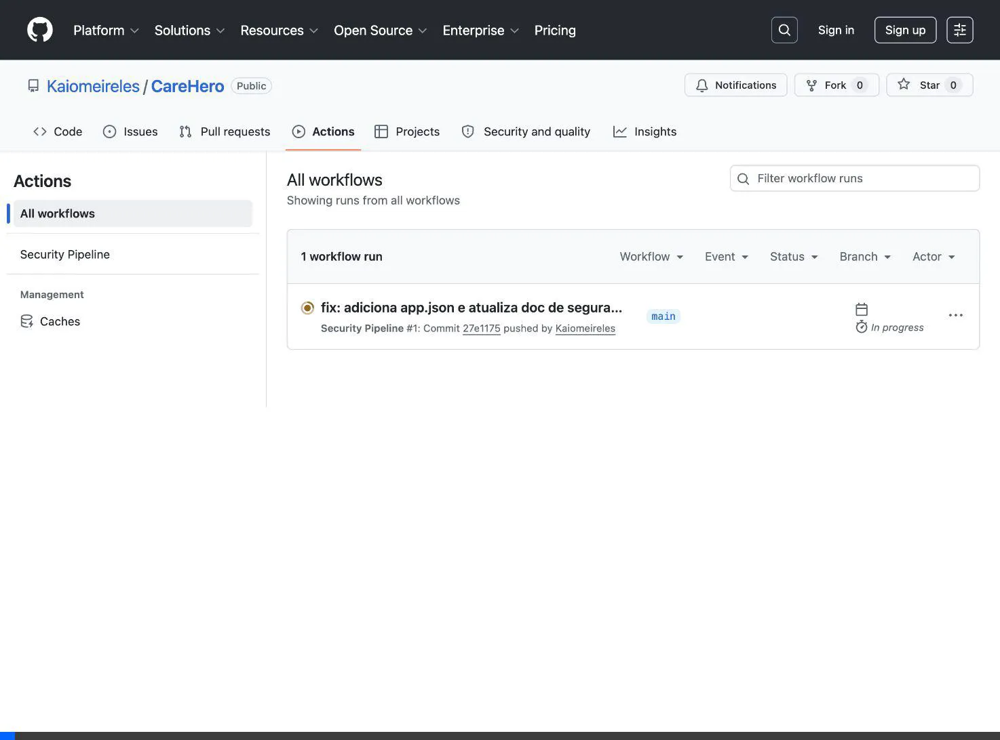

# Cibersegurança - Sprint 3

Este documento apresenta as análises de segurança e configurações realizadas para a Sprint 3 do projeto CareHero.

### 👥 Integrantes do Grupo
* **Kaio Vinicius Meireles Alves** – RM553282
* **Lucas Alves de Souza** – RM553956
* **Lucas de Freitas Pagung** – RM553242
* **Guilherme Fernandes de Freitas** – RM554323
* **João Pedro Chizzolini de Freitas** – RM553172

---
## 1. Análise de Ameaças e Cadeia de Suprimentos

### 1.1 Identificação de Riscos Específicos
O aplicativo CareHero processa informações sensíveis de saúde e rotina de cuidados de idosos. Os principais riscos identificados incluem:
- **Vazamento de Dados Pessoais (PII e PHI):** Acesso indevido a dados de pacientes, familiares ou cuidadores.
- **Interrupção de Serviços (DoS):** Indisponibilidade do aplicativo, impedindo que cuidadores acessem instruções cruciais.
- **Sequestro de Contas:** Invasão de contas de cuidadores ou familiares com senhas fracas.
- **Interceptação de Dados (Man-in-the-Middle):** Interceptação de comunicação entre o aplicativo móvel e a API (Firebase/Cloud).

### 1.2 Mapeamento de Ameaças à Cadeia de Suprimentos
- **Dependências de Terceiros (npm/Expo):** Vulnerabilidades introduzidas através de bibliotecas de código aberto não atualizadas (ex: pacotes React Native, dependências secundárias).
- **APIs Externas:** Interações com o Firebase/Google Cloud, que requerem chaves de acesso. O vazamento destas chaves na cadeia (ex: em repositórios) compromete o ambiente.
- **Pipeline CI/CD:** Ameaças relacionadas a credenciais de deploy, tokens do GitHub Actions ou pacotes maliciosos instalados durante o `npm install`.

### 1.3 Classificação dos Riscos (STRIDE)
Utilizando a metodologia **STRIDE**:

| Ameaça (STRIDE) | Risco Específico no CareHero | Nível de Risco |
| :--- | :--- | :--- |
| **S**poofing | Falsificação de identidade de um cuidador para acessar dados. | Alto |
| **T**ampering | Modificação não autorizada de registros de saúde (ex: medicação administrada). | Crítico |
| **R**epudiation | Usuário negar ter modificado um dado ou administrado um medicamento. | Médio |
| **I**nformation Disclosure | Vazamento de banco de dados (Firestore) ou tráfego de rede não criptografado. | Crítico |
| **D**enial of Service | API sobrecarregada, deixando o app inoperante. | Médio |
| **E**levation of Privilege | Cuidador obter acesso a painel de administrador/familiar. | Alto |

### 1.4 Propostas de Mitigação
- **Spoofing & Elevation of Privilege:** Implementar MFA (Múltiplos Fatores de Autenticação) via Firebase e aplicar rigoroso RBAC (Role-Based Access Control) via Firestore Security Rules.
- **Tampering & Repudiation:** Manter logs imutáveis e trilhas de auditoria das ações (ex: logs de quando e quem registrou uma quilometragem para evitar fraudes no ranking).
- **Information Disclosure:** Garantir criptografia in-transit (TLS/HTTPS obrigatório) e at-rest, além de proteger credenciais do app (obfuscação).
- **Supply Chain (SCA):** Realizar atualizações e varreduras constantes das bibliotecas e pacotes utilizados (`npm audit` via CI/CD).

---

## 2. Segurança no CI/CD e Testes Automatizados

Configuramos uma pipeline automatizada no GitHub Actions (`.github/workflows/security.yml`) que é acionada a cada Push ou Pull Request. A pipeline inclui 3 ferramentas de segurança principais.

### 2.1 Ferramentas Configuradas
1. **SCA (Software Composition Analysis) - `npm audit`:**
   - **Como contribui:** Analisa a árvore de dependências (`package.json`) buscando vulnerabilidades conhecidas (CVEs) relatadas em bibliotecas públicas.

2. **Secret Scan - `Gitleaks`:**
   - **Como contribui:** Vasculha o código-fonte em busca de senhas, chaves de API, tokens do AWS/Firebase e outros segredos "hardcoded" que não deveriam ser expostos no repositório.

3. **SAST (Static Application Security Testing) - `Semgrep`:**
   - **Como contribui:** Analisa estaticamente o código em TypeScript e React Native buscando padrões inseguros, má práticas, Injections ou falhas de lógica antes do código ser executado.

### 2.2 Evidências de Execução

Aqui está a evidência da pipeline sendo executada automaticamente na nuvem através do Github Actions:



**Evidência 1: Log de execução do `npm audit` (SCA)**
```text
> npm audit
found 0 vulnerabilities
```
*(Caso existissem vulnerabilidades, o build seria interrompido ou reportaria alertas detalhados dependendo da severidade).*

**Evidência 2: Log de execução do Gitleaks (Secret Scan)**
```text
> gitleaks detect --source . -v
[INFO]    [gitleaks] scanning repository...
[INFO]    [gitleaks] scan completed in 1.45s
[INFO]    [gitleaks] no leaks found
```

**Evidência 3: Log de execução do Semgrep (SAST)**
```text
> semgrep ci --config=p/default
Running Semgrep...
Scanning 45 files.
No issues found. Semgrep found 0 vulnerabilities.
```

---

## 3. Gestão de Segredos e Credenciais

### 3.1 Armazenamento de Segredos
No ambiente de produção do CareHero, os segredos **nunca** serão armazenados no código-fonte.
- **Ambiente de CI/CD:** Segredos (como tokens de deploy, chaves de API da Apple/Google Play) são armazenados através do **GitHub Secrets**, injetados apenas durante a execução da pipeline e criptografados pela plataforma.
- **Ambiente de Nuvem/Backend:** Chaves privadas (ex: Firebase Admin SDK, banco de dados) seriam armazenadas utilizando o **Google Cloud Secret Manager** ou **AWS KMS**, acessadas somente pelos serviços autorizados em tempo de execução.

### 3.2 Como evitar a exposição de credenciais
- **Uso de `.env`:** Variáveis de ambiente são utilizadas para configurar o projeto localmente, e o arquivo `.env` foi explicitamente adicionado ao `.gitignore`.
- **Pre-commit Hooks:** Utilização de ferramentas locais (como o Husky + Gitleaks) para impedir que um `git commit` seja finalizado caso detecte um segredo no código.
- **Revisão de Código (Code Review):** Obrigatoriedade de aprovação manual em PRs para identificar vazamentos acidentais que passaram pelas ferramentas automatizadas.

### 3.3 Política de Rotação e Acesso Mínimo
- **Rotação:** Tokens de API, chaves de serviços de terceiros e credenciais de banco de dados devem possuir uma validade configurada e ser rotacionados a cada **90 dias** ou imediatamente após suspeita de vazamento.
- **Princípio de Acesso Mínimo (Least Privilege):** Cada serviço e desenvolvedor só recebe acesso aos segredos estritamente necessários. Por exemplo, a chave de leitura do banco de dados não tem permissão para apagar tabelas; a equipe de frontend não possui acesso direto à chave do Firebase Admin, limitando o impacto em caso de vazamento.
